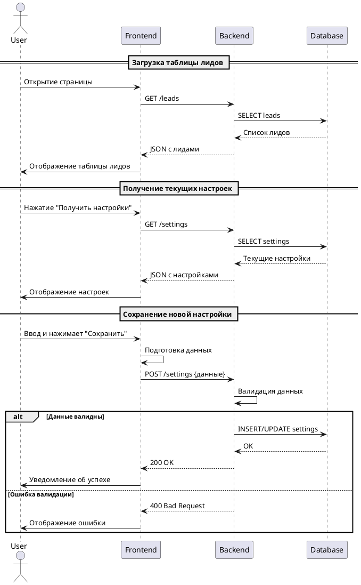

Необходимо создать функционал (настройки), с помощью которого можно управлять этапами, лиды с которых требуют подтверждения ОКК.

Для этого:

1. Вместо кнопки “Взаимодействие с воронками “ делаем иконку шестеренку. Так же в правах доступа переименовываем право в “настройки контроля качества” ( и ключ тоже )
    
2. По нажатию на шестеренку, открывается форма с разделами:  
    - Взаимодействие с воронками, логику и функционал оставляем  
    - Этапы для контроля  
    Новый раздел, в котором должна быть возможность выбирать дополнительные этапы к настройкам предыдущего раздела. Формат: Воронка → этап, через “плюсик” может быть n кол-во этапов.
    

Лиды, попадающие на этапы, выбранные в настройках описанной выше, попадают под логику обработки контроля качества. То есть, требуют решения:  
- Вернуть в работу ( выбор куда нужно лид отправить)  
- Подтвердить корректность действий сотрудника

Так же, необходимо сделать доработку, которая будет учитывать логику попадания лида повторно на проверку ОКК. Если лид, попадает на проверку ОКК ( контроль качества ), то в случае, если у него уже есть флаг об подтверждении проверки (ранее полученный), необходимо его сбрасывать. При этом не забывать про автоматически проставляемые флаги, что бы не сломать ничего.

Лог лида, должен отображать все подтверждения контроля качества.

---

UPD 21 мая 2025 г.

1. выбор воронок и этапов реализуем через amd-select2
    
2. перерабатываем логику контроля качества
    
    1. Теперь в контроль качества записи должны попадать явно, т.е. при переходе лида на этап в таблице контроля качества создаётся запись(если её там не было).
        
    2. В гриде контроля качества отображаются лиды, только у которых есть запись в таблице контроля качества
        
    3. отменяем функционал авто подтверждения
        
    4. из контроля качества убираем проверки на закрытый статус
        
    5. функционал “вернуть в работу“ должен удалять запись из контроля качества

[[AMDN-188 - начало работы]]
#plantuml 
