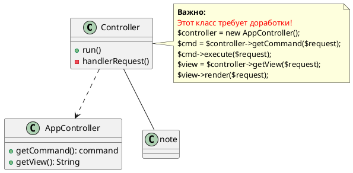

```plantuml
class Controller {
	+run()
	-handlerRequest()
}

class AppController {
	+getCommand(): command
	+getView(): String
}

Controller ..> AppController

note right of Controller
  <b>Важно:</b>
  <color:red>Этот класс требует доработки!</color>
  $controller = new AppController ( ) ;
  $cmd = $controlter->getCommand ( $request ) ;
  $cmd ->execute ( $request ) ;
  $view = $controller- >getView( $request ) ;
  $view- >render ( $request ) ;
end note
```



#plantuml 
