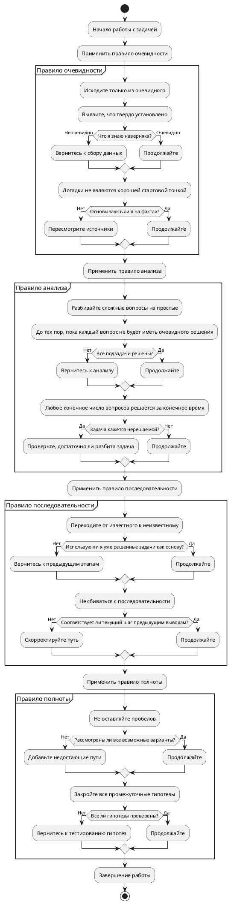

```plantuml
@startuml
start

:Начало работы с задачей;

:Применить правило очевидности;
partition Правило очевидности {
    :Исходите только из очевидного;
    :Выявите, что твердо установлено;
    if (Что я знаю наверняка?) then (Неочевидно)
        :Вернитесь к сбору данных;
    else (Очевидно)
        :Продолжайте;
    endif
    :Догадки не являются хорошей стартовой точкой;
    if (Основываюсь ли я на фактах?) then (Нет)
        :Пересмотрите источники;
    else (Да)
        :Продолжайте;
    endif
}

:Применить правило анализа;
partition Правило анализа {
    :Разбивайте сложные вопросы на простые;
    :До тех пор, пока каждый вопрос не будет иметь очевидного решения;
    if (Все подзадачи решены?) then (Нет)
        :Вернитесь к анализу;
    else (Да)
        :Продолжайте;
    endif
    :Любое конечное число вопросов решается за конечное время;
    if (Задача кажется нерешаемой?) then (Да)
        :Проверьте, достаточно ли разбита задача;
    else (Нет)
        :Продолжайте;
    endif
}

:Применить правило последовательности;
partition Правило последовательности {
    :Переходите от известного к неизвестному;
    if (Использую ли я уже решенные задачи как основу?) then (Нет)
        :Вернитесь к предыдущим этапам;
    else (Да)
        :Продолжайте;
    endif
    :Не сбиваться с последовательности;
    if (Соответствует ли текущий шаг предыдущим выводам?) then (Нет)
        :Скорректируйте путь;
    else (Да)
        :Продолжайте;
    endif
}

:Применить правило полноты;
partition Правило полноты {
    :Не оставляйте пробелов;
    if (Рассмотрены ли все возможные варианты?) then (Нет)
        :Добавьте недостающие пути;
    else (Да)
        :Продолжайте;
    endif
    :Закройте все промежуточные гипотезы;
    if (Все ли гипотезы проверены?) then (Нет)
        :Вернитесь к тестированию гипотез;
    else (Да)
        :Продолжайте;
    endif
}

:Завершение работы;
stop
@enduml
```