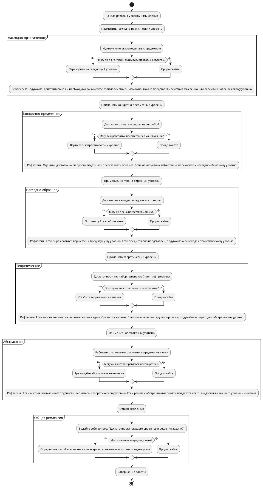

```plantuml
@startuml
start

:Начало работы с уровнями мышления;

:Применить наглядно-практический уровень;
partition Наглядно-практическое {
    :Нужно что-то активно делать с предметом;
    if (Могу ли я физически взаимодействовать с объектом?) then (Нет)
        :Переходите на следующий уровень;
    else (Да)
        :Продолжайте;
    endif
    :Рефлексия: Подумайте, действительно ли необходимо физическое взаимодействие. Возможно, можно представить действия мысленно или перейти к более высокому уровню;
}

:Применить конкретно-предметный уровень;
partition Конкретно-предметное {
    :Достаточно иметь предмет перед собой;
    if (Могу ли я работать с предметом без манипуляций?) then (Нет)
        :Вернитесь к практическому уровню;
    else (Да)
        :Продолжайте;
    endif
    :Рефлексия: Оцените, достаточно ли просто видеть или представлять предмет. Если манипуляции избыточны, переходите к наглядно-образному уровню;
}

:Применить наглядно-образный уровень;
partition Наглядно-образное {
    :Достаточно наглядно представить предмет;
    if (Могу ли я ясно представить объект?) then (Нет)
        :Потренируйте воображение;
    else (Да)
        :Продолжайте;
    endif
    :Рефлексия: Если образ размыт, вернитесь к предыдущему уровню. Если предмет ясно представлен, подумайте о переходе к теоретическому уровню;
}

:Применить теоретический уровень;
partition Теоретическое {
    :Достаточно знать набор признаков (понятие) предмета;
    if (Оперирую ли я понятиями, а не образами?) then (Нет)
        :Углубите теоретические знания;
    else (Да)
        :Продолжайте;
    endif
    :Рефлексия: Если теория непонятна, вернитесь к наглядно-образному уровню. Если понятия четко структурированы, подумайте о переходе к абстрактному уровню;
}

:Применить абстрактный уровень;
partition Абстрактное {
    :Работаем с понятиями о понятиях, предмет не нужен;
    if (Могу ли я абстрагироваться от конкретики?) then (Нет)
        :Тренируйте абстрактное мышление;
    else (Да)
        :Продолжайте;
    endif
    :Рефлексия: Если абстракция вызывает трудности, вернитесь к теоретическому уровню. Если работа с абстрактными понятиями дается легко, вы достигли высшего уровня мышления;
}

:Общая рефлексия;
partition Общая рефлексия {
    :Задайте себе вопрос: "Достаточно ли текущего уровня для решения задачи?";
    if (Достаточно ли текущего уровня?) then (Нет)
        :Определите, какой шаг — вниз или вверх по уровням — поможет продвинуться;
    else (Да)
        :Продолжайте;
    endif
}

:Завершение работы;
stop
@enduml
```