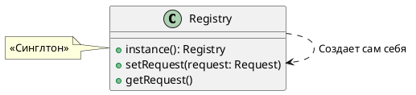
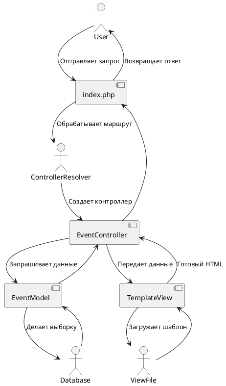
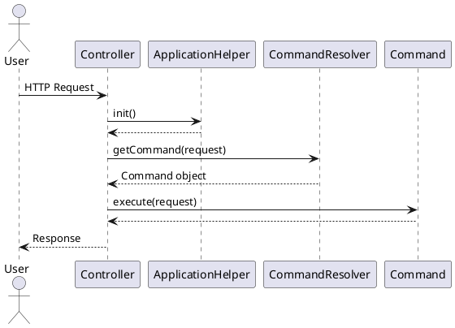

# Registry

# Front Controller

1. [[]]
2. [[QWEN zandstra frontcontroller]]

# Page Controller

Понял!

Анализируя текст, я выделяю **3 примера** для практической реализации шаблона Page Controller:

## Примеры для реализации:

1. **simple-page-controller** - Простейший пример (стр. 500-501, Листинг 12.34)
2. **separated-page-controller** - Пример с базовым классом PageController (стр. 502-505, Листинги 12.35-12.38)
3. **complete-page-controller** - Полная реализация с несколькими контроллерами (стр. 505-506, Рис. 12.9)

## Теоретический смысл:

Шаблон Page Controller решает задачу управления взаимосвязью между запросом, логикой приложения и представлением данных для относительно простых проектов, где развертывание крупной структуры Front Controller нецелесообразно.

## Практический смысл:

- Быстрая разработка простых веб-приложений
- Понятная структура "одна страница - один контроллер"
- Минимальные накладные расходы на архитектуру
- Легкость понимания для разработчиков

Каждый пример будет иметь свою папку с центральным `script.php` файлом для запуска.

Готов начать с **первого примера**? Скажите "следующий шаг" и мы приступим к реализации простейшего Page Controller.

_Также рекомендую сейчас посмотреть на диаграмму на стр. 501 (Рис. 12.8) для понимания общей структуры._