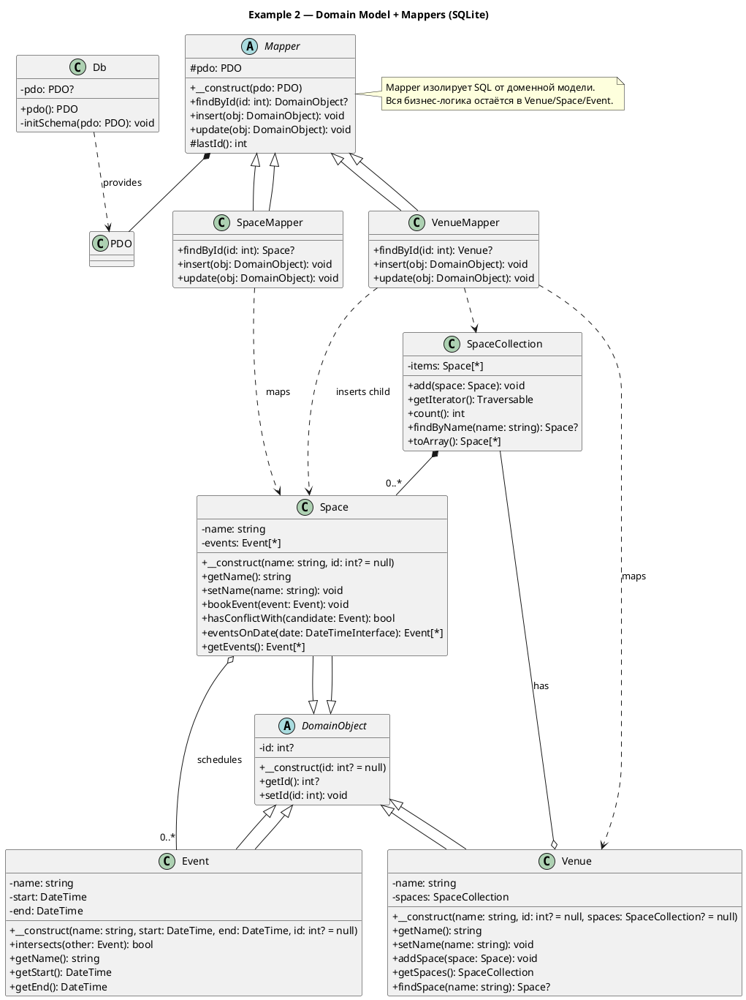
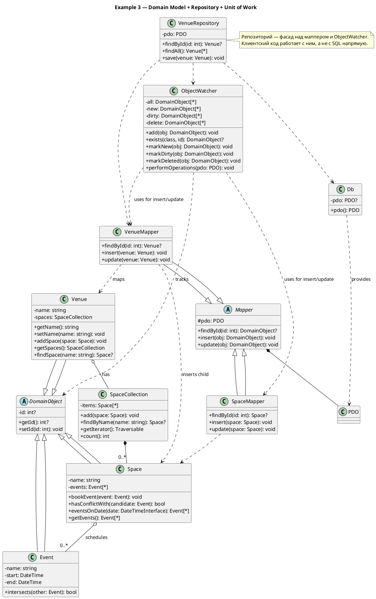
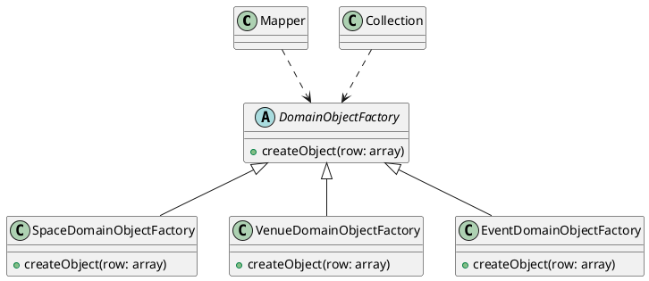

# Шаблоны баз данных 

# Domain model + Repository + Unit of work

# Domain object factory (566 стр)

На второй картинке снова **UML-диаграмма классов**, но теперь уже про фабрики объектов предметной области.

🔎 Разбор:

1. **Mapper** и **Collection**
    
    - Они связаны пунктирной зависимостью с `DomainObjectFactory`.
        
    - То есть используют фабрику для создания объектов.
        
2. **DomainObjectFactory** (абстрактная фабрика)
    
    - Метод: `+createObject(row: array)`
        
    - Это базовый интерфейс/абстрактный класс для конкретных фабрик.
        
3. Конкретные фабрики, наследники:
    
    - **SpaceDomainObjectFactory**
        
    - **VenueDomainObjectFactory**
        
    - **EventDomainObjectFactory**  
        Все они реализуют метод `createObject(row: array)`.
        

Таким образом, эта часть описывает **шаблон проектирования Factory Method** (или Abstract Factory) для создания объектов (`Venue`, `Space`, `Event`) на основе данных (например, строки из БД).

---