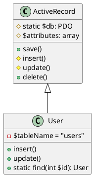

```plantuml
@startuml
class ActiveRecord {
  # static $db: PDO
  # $attributes: array
  + save()
  # insert()
  # update()
  + delete()
}

class User {
  - $tableName = "users"
  + insert()
  + update()
  + static find(int $id): User
}

ActiveRecord <|-- User
@enduml
```

#plantuml 

