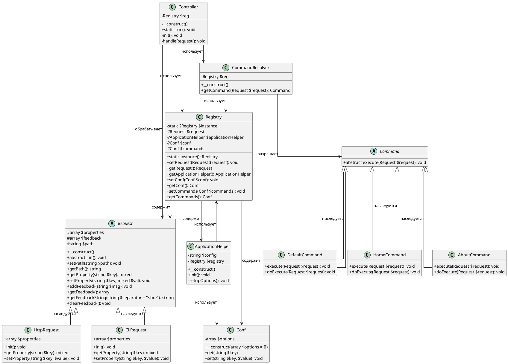

### **Описание диаграммы**

1. **Класс `Registry`** :
    
    - Реестр (`Registry`) является центральным хранилищем для общих объектов, таких как `Request`, `ApplicationHelper`, `Conf` (конфигурация) и `Commands`.
    - Использует паттерн Singleton для обеспечения единого экземпляра.
2. **Класс `Request`** :
    
    - Абстрактный базовый класс для всех типов запросов.
    - Содержит свойства для хранения данных запроса, пути и сообщений обратной связи.
    - Реализованы методы для работы с этими данными.
3. **Классы `HttpRequest` и `CliRequest`** :
    
    - Наследуются от `Request`.
    - Предоставляют специфическую реализацию метода `init()` для HTTP-запросов и CLI-запросов.
4. **Класс `ApplicationHelper`** :
    
    - Отвечает за инициализацию приложения.
    - Читает конфигурацию из файла и сохраняет её в реестре.
    - Определяет тип запроса (HTTP или CLI) и создает соответствующий объект `Request`.
5. **Класс `Conf`** :
    
    - Хранит конфигурационные данные в виде массива.
    - Предоставляет методы для получения и установки значений.
6. **Класс `Command`** :
    
    - Абстрактный базовый класс для всех команд.
    - Определяет метод `execute()`, который вызывает метод `doExecute()` в дочерних классах.
7. **Классы `DefaultCommand`, `HomeCommand`, `AboutCommand`** :
    
    - Конкретные реализации команд.
    - Выполняют логику обработки запросов и включают файлы представлений.
8. **Класс `CommandResolver`** :
    
    - Разрешает команду на основе пути запроса.
    - Использует данные из реестра для выбора нужного класса команды.
9. **Класс `Controller`** :
    
    - Центральный элемент системы.
    - Управляет процессом обработки запроса: инициализация, получение команды, выполнение команды.

---

### **Связи между классами**

1. **Ассоциации** :
    
    - `Registry` связан с `Request`, `ApplicationHelper`, `Conf` и `Commands`.
    - `Controller` связан с `Registry`, `CommandResolver` и `Request`.
2. **Наследование** :
    
    - `HttpRequest` и `CliRequest` наследуются от `Request`.
    - `DefaultCommand`, `HomeCommand` и `AboutCommand` наследуются от `Command`.
3. **Зависимости** :
    
    - `CommandResolver` зависит от `Registry` для получения данных о командах.
    - `Controller` зависит от `CommandResolver` для выбора команды.

---

### **Заключение**

Эта диаграмма наглядно демонстрирует структуру вашего приложения и взаимосвязи между его компонентами. Она помогает понять, как организованы классы и как они взаимодействуют друг с другом. Если потребуется дополнительная детализация или пояснения, дайте знать!