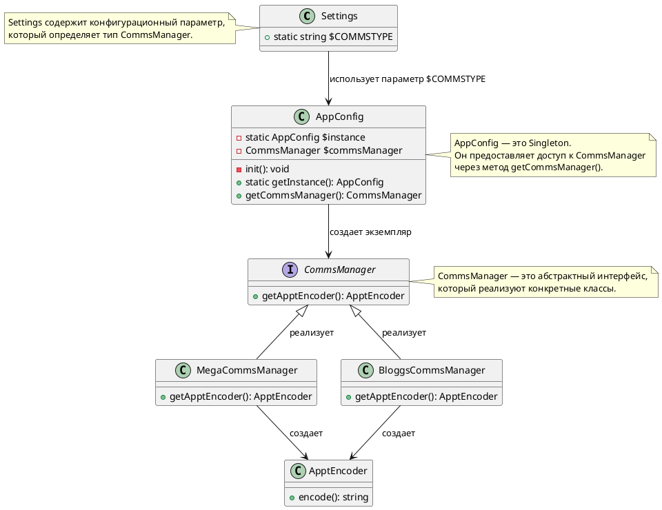

```plantuml
@startuml
' Определение классов

class Settings {
    + static string $COMMSTYPE
}

class AppConfig {
    - static AppConfig $instance
    - CommsManager $commsManager
    - init(): void
    + static getInstance(): AppConfig
    + getCommsManager(): CommsManager
}

interface CommsManager {
    + getApptEncoder(): ApptEncoder
}

class MegaCommsManager {
    + getApptEncoder(): ApptEncoder
}

class BloggsCommsManager {
    + getApptEncoder(): ApptEncoder
}

class ApptEncoder {
    + encode(): string
}

' Отношения между классами

Settings --> AppConfig : использует параметр $COMMSTYPE
AppConfig --> CommsManager : создает экземпляр
CommsManager <|-- MegaCommsManager : реализует
CommsManager <|-- BloggsCommsManager : реализует
MegaCommsManager --> ApptEncoder : создает
BloggsCommsManager --> ApptEncoder : создает

' Пример использования

note right of AppConfig
    AppConfig — это Singleton.
    Он предоставляет доступ к CommsManager
    через метод getCommsManager().
end note

note left of Settings
    Settings содержит конфигурационный параметр,
    который определяет тип CommsManager.
end note

note right of CommsManager
    CommsManager — это абстрактный интерфейс,
    который реализуют конкретные классы.
end note

@enduml
```