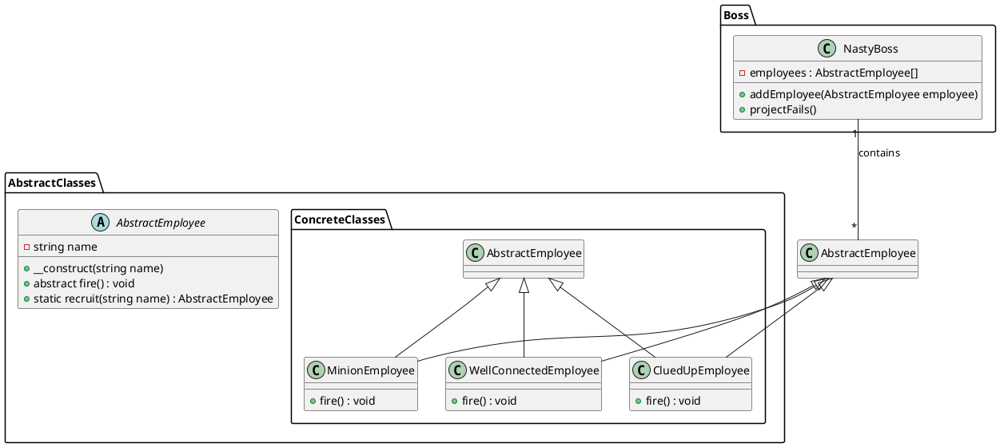

```plantuml
@startuml

namespace AbstractClasses {
    abstract class AbstractEmployee {
        - string name
        + __construct(string name)
        + abstract fire() : void
        + static recruit(string name) : AbstractEmployee
    }

    namespace ConcreteClasses {
        class MinionEmployee extends AbstractEmployee {
            + fire() : void
        }

        class WellConnectedEmployee extends AbstractEmployee {
            + fire() : void
        }

        class CluedUpEmployee extends AbstractEmployee {
            + fire() : void
        }
    }
}

namespace Boss {
    class NastyBoss {
        - employees : AbstractEmployee[]
        + addEmployee(AbstractEmployee employee)
        + projectFails()
    }
}

AbstractEmployee <|-- MinionEmployee
AbstractEmployee <|-- WellConnectedEmployee
AbstractEmployee <|-- CluedUpEmployee

NastyBoss "1" -- "*" AbstractEmployee : contains

@enduml
```