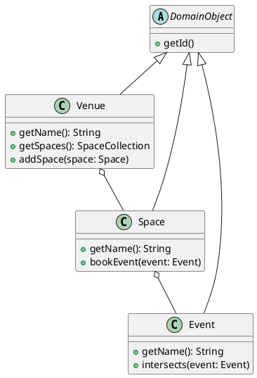

```plantuml
@startuml

' Абстрактный класс
abstract class DomainObject {
    +getId()
}

class Venue {
    +getName(): String
    +getSpaces(): SpaceCollection
    +addSpace(space: Space)
}

class Space {
    +getName(): String
    +bookEvent(event: Event)
}

class Event {
    +getName(): String
    +intersects(event: Event)
}

' Наследование
DomainObject <|-- Venue
DomainObject <|-- Space
DomainObject <|-- Event

' Агрегации
Venue o-- Space
Space o-- Event

@enduml

```
