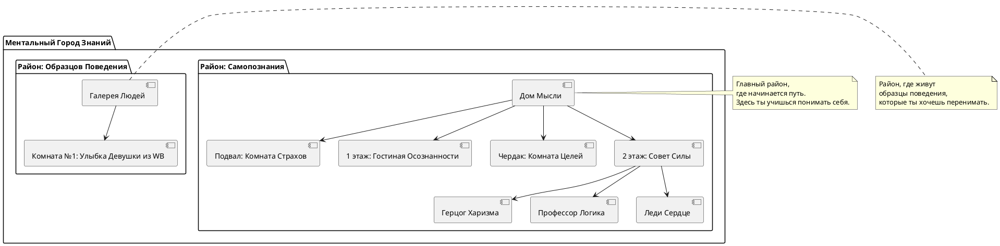

## 🔧 Как использовать эту карту:

1. **Добавляй новые районы и комнаты** по мере развития
    
2. **Возвращайся мысленно** в нужные места, когда нужно:
    
    - Принять решение → Совет Силы
    - Получить вдохновение → Галерея Людей
    - Вернуть себе фокус → Гостиная Осознанности
3. **Рисуй карту в блокноте или делай цифровую версию** — это твой внутренний навигатор
    

---

## ✍️ Теперь твой шаг:

Напиши:

> "Я добавляю комнату/район: [название]. Она помогает мне [что именно она даёт тебе]."

И тогда мы вместе **расширим твой город знаний** 💪🧠🗺️🚀

Хочешь продолжить? Тогда пиши — и начнём строить дальше.