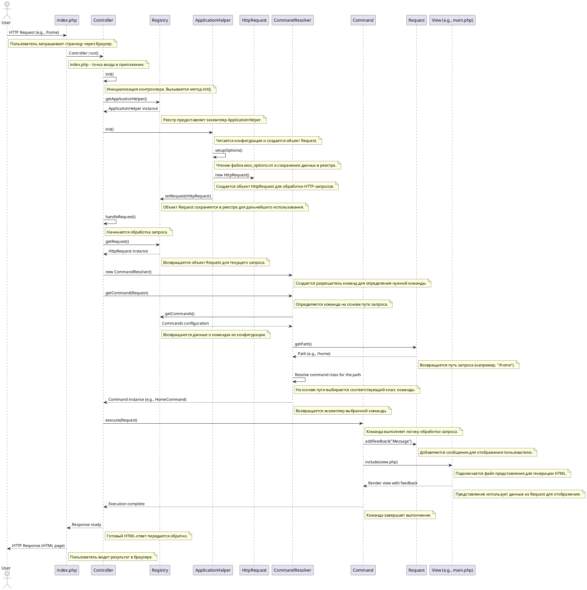

### **Пояснения к каждому шагу**

1. **Шаг 1: Пользователь отправляет HTTP-запрос**
    
    - Пользователь обращается к приложению через браузер (например, `http://localhost/index.php/home`).
    - Это начальная точка взаимодействия.
2. **Шаг 2: Точка входа вызывает статический метод `run()`**
    
    - Файл `index.php` является точкой входа и вызывает метод `Controller::run()`.
    - Этот метод запускает процесс обработки запроса.
3. **Шаг 3: Создание экземпляра контроллера**
    
    - Контроллер инициализируется и вызывает метод `init()` для подготовки системы.
4. **Шаг 4: Получение `ApplicationHelper` из реестра**
    
    - Контроллер получает объект `ApplicationHelper` из реестра (`Registry`), который управляет конфигурацией и инициализацией.
5. **Шаг 5: Инициализация `ApplicationHelper`**
    
    - Метод `init()` читает конфигурацию и создает объект запроса (`HttpRequest`).
6. **Шаг 6: Настройка конфигурации**
    
    - Метод `setupOptions()` читает файл `woo_options.ini` и сохраняет данные в реестре.
7. **Шаг 7: Определение типа запроса**
    
    - Если запрос поступает через HTTP, создается объект `HttpRequest`. Для CLI используется `CliRequest`.
8. **Шаг 8: Сохранение объекта `Request` в реестре**
    
    - Объект `Request` сохраняется в реестре для доступа из других частей системы.
9. **Шаг 9: Обработка запроса**
    
    - Метод `handleRequest()` начинает обработку запроса.
10. **Шаг 10: Получение объекта `Request` из реестра**
    
    - Контроллер получает объект `Request`, содержащий данные о запросе.
11. **Шаг 11: Создание `CommandResolver`**
    
    - Создается объект `CommandResolver`, который определяет, какую команду выполнить.
12. **Шаг 12: Разрешение команды**
    
    - Метод `getCommand()` определяет команду на основе пути запроса.
13. **Шаг 13: Получение списка команд из реестра**
    
    - Список команд извлекается из реестра для выбора нужной команды.
14. **Шаг 14: Получение пути из запроса**
    
    - Путь запроса извлекается из объекта `Request`.
15. **Шаг 15: Выбор команды**
    
    - На основе пути выбирается соответствующий класс команды.
16. **Шаг 16: Создание экземпляра команды**
    
    - Создается экземпляр выбранной команды (например, `HomeCommand`).
17. **Шаг 17: Выполнение команды**
    
    - Метод `execute()` команды выполняет логику обработки запроса.
18. **Шаг 18: Добавление сообщений обратной связи**
    
    - Сообщения добавляются в объект `Request` для отображения пользователю.
19. **Шаг 19: Включение представления**
    
    - Подключается файл представления (например, `views/home.php`) для генерации HTML.
20. **Шаг 20: Отображение представления**
    
    - Представление использует данные из объекта `Request` для отображения.
21. **Шаг 21: Завершение выполнения команды**
    
    - Команда завершает выполнение и возвращает управление контроллеру.
22. **Шаг 22: Возврат ответа**
    
    - Готовый HTML-ответ передается обратно в точку входа.
23. **Шаг 23: Отправка HTTP-ответа пользователю**
    
    - Пользователь видит результат в браузере.

---

### **Заключение**

Эта диаграмма наглядно демонстрирует, как компоненты взаимодействуют друг с другом в рамках шаблона **Front Controller** . Каждый шаг имеет четкое назначение и объяснение, что помогает понять архитектуру и логику работы системы.