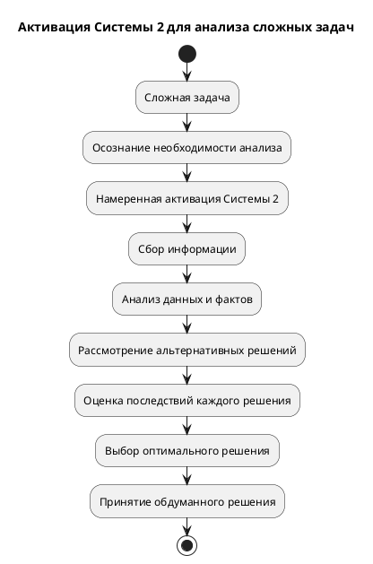

Конечно, вот PlantUML диаграмма, визуализирующая процесс активации Системы 2 для анализа сложных задач и принятия обдуманных решений:

**Объяснение диаграммы:**

1.  **Сложная задача:** Начальная точка, представляющая сложную задачу, требующую анализа и обдуманного решения.
2.  **Осознание необходимости анализа:** Понимание того, что для решения задачи требуется тщательный анализ и нельзя полагаться на интуицию или быстрые решения.
3.  **Намеренная активация Системы 2:** Сознательное усилие по включению медленного, аналитического мышления (Система 2).
4.  **Сбор информации:** Активный поиск и сбор релевантной информации, данных и фактов, относящихся к задаче.
5.  **Анализ данных и фактов:** Тщательное изучение и анализ собранной информации для выявления закономерностей, связей и проблем.
6.  **Рассмотрение альтернативных решений:** Генерация и рассмотрение различных возможных решений задачи.
7.  **Оценка последствий каждого решения:** Прогнозирование и оценка потенциальных последствий каждого из альтернативных решений.
8.  **Выбор оптимального решения:** Выбор наиболее подходящего решения на основе анализа и оценки последствий.
9.  **Принятие обдуманного решения:** Формирование окончательного решения, основанного на рациональном анализе и взвешенной оценке.
10. **Конец:** Конечная точка, когда обдуманное решение принято.

**Как использовать эту диаграмму:**

*   Скопируй этот код в текстовый файл с расширением `.plantuml`.
*   Открой этот файл с помощью программы, поддерживающей PlantUML (например, Visual Studio Code с расширением PlantUML или онлайн-редактор PlantUML).
*   Программа сгенерирует визуальную диаграмму на основе кода.

Эта диаграмма поможет визуализировать шаги, необходимые для активации Системы 2 и использования ее для анализа сложных задач и принятия обдуманных решений.
