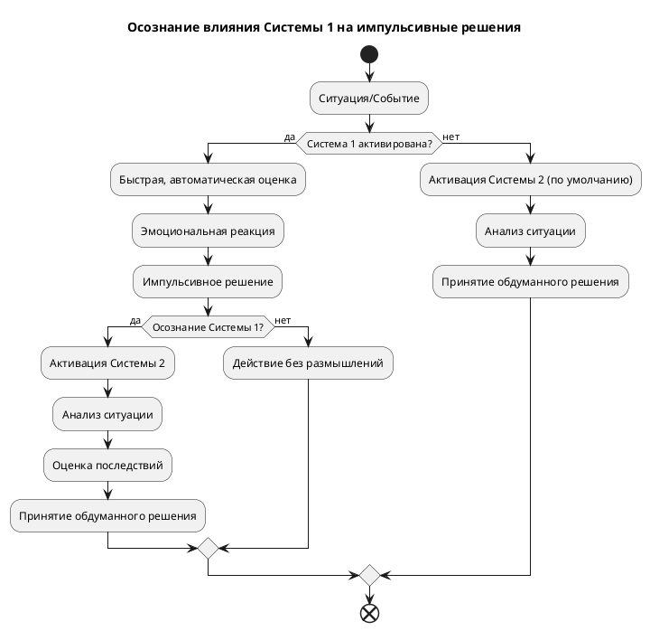

Конечно, я могу помочь тебе раскрыть тему "Осознавайте, когда Система 1 берет верх и может привести к импульсивным решениям" в виде PlantUML диаграммы. Вот пример диаграммы, которая визуализирует этот процесс:

**Объяснение диаграммы:**

1.  **Ситуация/Событие:** Начальная точка, когда возникает какая-либо ситуация или событие.
2.  **Система 1 активирована?:** Проверка, активируется ли Система 1 (быстрое, интуитивное мышление) в ответ на ситуацию.
    *   **Да:** Если Система 1 активирована, происходит быстрая, автоматическая оценка ситуации, что приводит к эмоциональной реакции и, возможно, импульсивному решению.
        *   **Осознание Системы 1?:** Проверка, осознает ли человек, что Система 1 влияет на его решение.
            *   **Да:** Если осознание есть, активируется Система 2 (медленное, аналитическое мышление), происходит анализ ситуации, оценка последствий и принятие обдуманного решения.
            *   **Нет:** Если осознания нет, происходит действие без размышлений, основанное на импульсивном решении.
    *   **Нет:** Если Система 1 не активирована (или подавлена), по умолчанию активируется Система 2, происходит анализ ситуации и принятие обдуманного решения.
3.  **Конец:** Конечная точка, когда решение принято и действие совершено.

**Как использовать эту диаграмму:**

*   Скопируй этот код в текстовый файл с расширением `.plantuml`.
*   Открой этот файл с помощью программы, поддерживающей PlantUML (например, Visual Studio Code с расширением PlantUML или онлайн-редактор PlantUML).
*   Программа сгенерирует визуальную диаграмму на основе кода.

Эта диаграмма поможет тебе визуализировать процесс принятия решений под влиянием Системы 1 и понять, как осознание этого влияния может привести к более обдуманным решениям.
