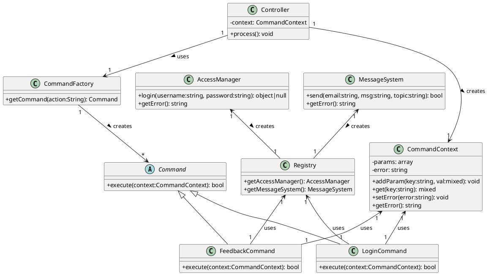

```plantuml
skinparam classAttributeIconSize 0

' Основные классы
abstract class Command {
    +execute(context:CommandContext): bool
}

class LoginCommand {
    +execute(context:CommandContext): bool
}

class FeedbackCommand {
    +execute(context:CommandContext): bool
}

class CommandFactory {
    +getCommand(action:String): Command
}

class Controller {
    -context: CommandContext
    +process(): void
}

class CommandContext {
    -params: array
    -error: string
    +addParam(key:string, val:mixed): void
    +get(key:string): mixed
    +setError(error:string): void
    +getError(): string
}

class Registry {
    +getAccessManager(): AccessManager
    +getMessageSystem(): MessageSystem
}

' Вспомогательные классы
class AccessManager {
    +login(username:string, password:string): object|null
    +getError(): string
}

class MessageSystem {
    +send(email:string, msg:string, topic:string): bool
    +getError(): string
}

' Связи
Command <|-- LoginCommand
Command <|-- FeedbackCommand

CommandContext "1" <-- "1" LoginCommand : uses
CommandContext "1" <-- "1" FeedbackCommand : uses

Registry "1" <-- "1" LoginCommand : uses
Registry "1" <-- "1" FeedbackCommand : uses

Controller "1" --> "1" CommandFactory : uses >
Controller "1" --> "1" CommandContext : creates >

CommandFactory "1" --> "*" Command : creates >

AccessManager "1" <-- "1" Registry : creates >
MessageSystem "1" <-- "1" Registry : creates >

```

Вот диаграмма PlantUML для паттерна Command на основе предоставленного текста:



### Объяснение элементов и их взаимодействия:

#### Теоретический смысл:
1. **Command (Абстрактный класс)**:
   - **Теория**: Определяет общий интерфейс для всех конкретных команд.
   - **Практика**: Все команды должны реализовать метод `execute()`, что обеспечивает единообразие работы с разными командами.

2. **Concrete Commands (LoginCommand, FeedbackCommand)**:
   - **Теория**: Реализуют конкретную логику выполнения операций.
   - **Практика**: Каждая команда инкапсулирует определенную бизнес-логику (например, авторизация или отправка обратной связи).

3. **CommandFactory**:
   - **Теория**: Отвечает за создание экземпляров команд.
   - **Практика**: Позволяет динамически создавать нужные команды на основе входных данных, что делает систему легко расширяемой.

4. **Controller**:
   - **Теория**: Выступает в роли вызывающего объекта, который управляет выполнением команд.
   - **Практика**: Централизует процесс обработки запросов и выполнения соответствующих команд.

5. **CommandContext**:
   - **Теория**: Хранит данные запроса и результаты выполнения команд.
   - **Практика**: Используется для передачи параметров между уровнями приложения и хранения состояния выполнения.

6. **Registry**:
   - **Теория**: Предоставляет доступ к общим сервисам (например, менеджеру доступа или системе сообщений).
   - **Практика**: Упрощает управление зависимостями через централизованный доступ к службам.

7. **Receiver Classes (AccessManager, MessageSystem)**:
   - **Теория**: Содержат бизнес-логику приложения.
   - **Практика**: Выполняют реальные операции, такие как проверка логина/пароля или отправка сообщений.

---

#### Практическое взаимодействие:
1. **Запрос пользователя**:
   - Пользователь отправляет запрос (например, с параметром `action=login`).

2. **Обработка контроллером**:
   - `Controller` получает запрос и извлекает параметры через `CommandContext`.

3. **Создание команды**:
   - `Controller` использует `CommandFactory` для создания конкретной команды (например, `LoginCommand`) на основе параметра `action`.

4. **Выполнение команды**:
   - Созданная команда выполняет метод `execute()`, используя данные из `CommandContext`.
   - Команда взаимодействует с соответствующим сервисом через `Registry` (например, `AccessManager` для авторизации).

5. **Обработка результата**:
   - Результат выполнения (успех или ошибка) сохраняется в `CommandContext`.
   - `Controller` может использовать этот результат для дальнейшей обработки (например, отображение ошибки или перенаправление).

---

#### Преимущества такого подхода:
1. **Масштабируемость**:
   - Новые команды можно добавлять без изменения существующего кода (принцип Open/Closed).

2. **Разделение ответственности**:
   - Каждый класс имеет четко определенную роль, что упрощает поддержку и тестирование.

3. **Гибкость**:
   - Легко изменять или расширять логику выполнения команд, не затрагивая остальную часть системы.

4. **Повторное использование**:
   - Команды и сервисы могут быть переиспользованы в разных частях приложения.

Эта диаграмма и объяснение дают полное представление о структуре и работе паттерна Command в контексте веб-приложения.

![[Pasted image 20250301172633.png]]